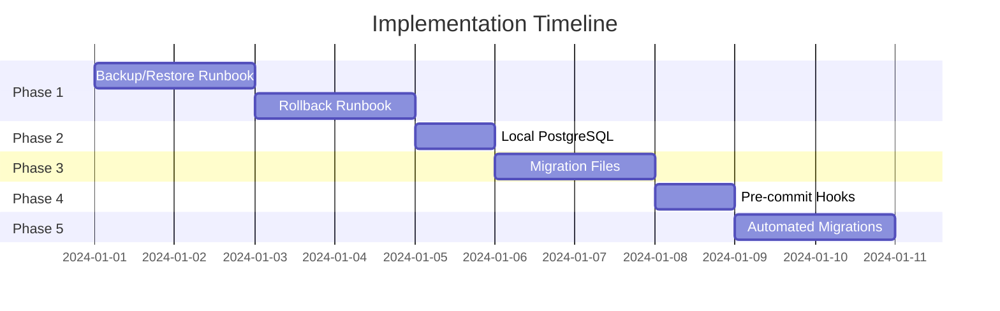

# Development & Deployment Improvements - Implementation Order

## Executive Summary
This document outlines the recommended order for implementing six major improvements to the development and deployment processes. The order is designed to maximize benefit while minimizing risk and building upon each previous improvement.

## Recommended Implementation Order

### Phase 1: Foundation (Week 1-2)
#### 1. Database Backup and Restore Runbook (Plan #5)
**Why First:** Before making any infrastructure changes, ensure we can recover from disasters.
- **Duration:** 11-13 hours
- **Priority:** CRITICAL
- **Risk:** None - purely additive
- **Dependencies:** None
- **Benefits:** 
  - Immediate safety net for all future changes
  - Peace of mind for aggressive improvements
  - Required for compliance

#### 2. Deployment Rollback Runbook (Plan #6)
**Why Second:** Establish safety procedures before changing deployment processes.
- **Duration:** 12-15 hours
- **Priority:** CRITICAL
- **Risk:** None - purely procedural
- **Dependencies:** Backup procedures (Plan #5)
- **Benefits:**
  - Rapid recovery from bad deployments
  - Reduced fear of deploying
  - Foundation for automated deployments

### Phase 2: Local Development (Week 2-3)
#### 3. Local PostgreSQL Database (Plan #1)
**Why Third:** Improve development speed and enable safe testing of migrations.
- **Duration:** 4-6 hours
- **Priority:** HIGH
- **Risk:** Low - doesn't affect production
- **Dependencies:** Backup procedures established
- **Benefits:**
  - 10x faster development
  - Offline development capability
  - Safe migration testing environment

### Phase 3: Schema Management (Week 3-4)
#### 4. Prisma Migration Files (Plan #2)
**Why Fourth:** Version control for database changes before automating them.
- **Duration:** 9-11 hours
- **Priority:** HIGH
- **Risk:** Medium - requires careful baseline
- **Dependencies:** Local database for testing
- **Benefits:**
  - Version-controlled schema
  - Rollback capability for schema
  - Team collaboration on database changes

### Phase 4: Quality Gates (Week 4-5)
#### 5. Pre-commit Hooks (Plan #3)
**Why Fifth:** Prevent bad code/migrations from entering the repository.
- **Duration:** 7-8 hours
- **Priority:** MEDIUM
- **Risk:** Low - can be disabled if needed
- **Dependencies:** Migration system established
- **Benefits:**
  - No more broken builds
  - Consistent code quality
  - Faster CI/CD pipeline

### Phase 5: Automation (Week 5-6)
#### 6. Automated Migration Deployment (Plan #4)
**Why Last:** Automate only after all safety measures are in place.
- **Duration:** 10-12 hours
- **Priority:** MEDIUM
- **Risk:** High - can break deployments
- **Dependencies:** All previous improvements
- **Benefits:**
  - Zero-downtime deployments
  - No manual migration steps
  - Consistent deployment process

## Alternative Orders Considered

### Alternative A: Speed First
Order: 1 → 3 → 5 → 2 → 4 → 6
- Pros: Faster development immediately
- Cons: No safety net during changes
- **Rejected:** Too risky without backup procedures

### Alternative B: Automation First
Order: 2 → 4 → 6 → 3 → 5 → 1
- Pros: Quick deployment improvements
- Cons: Automating broken processes
- **Rejected:** Need stable foundation first

### Alternative C: Minimal Risk
Order: 5 → 6 → 1 → 3 → 2 → 4
- Pros: All safety measures first
- Cons: Slow initial progress
- **Rejected:** Too conservative, delays benefits

## Implementation Timeline



## Total Investment

| Plan | Hours | Complexity | Risk |
|------|-------|------------|------|
| Backup/Restore (#5) | 11-13 | Medium | None |
| Rollback (#6) | 12-15 | Medium | None |
| Local DB (#1) | 4-6 | Low | Low |
| Migrations (#2) | 9-11 | High | Medium |
| Pre-commit (#3) | 7-8 | Medium | Low |
| Auto-deploy (#4) | 10-12 | High | High |
| **TOTAL** | **53-65 hours** | | |

## Risk Mitigation Strategy

### Phase 1 Risks: None
- Documentation only
- No system changes

### Phase 2 Risks: Local Environment
- **Mitigation:** Keep cloud DB connection available
- **Rollback:** Simple config change

### Phase 3 Risks: Schema Baseline
- **Mitigation:** Take backup before baseline
- **Rollback:** Use backup/restore procedures

### Phase 4 Risks: Developer Friction
- **Mitigation:** Provide bypass option
- **Rollback:** Disable hooks temporarily

### Phase 5 Risks: Deployment Failures
- **Mitigation:** Extensive testing in preview
- **Rollback:** Use rollback runbook

## Success Metrics

### Week 1-2 (After Phase 1)
- [ ] Successful backup restore test
- [ ] Rollback executed in < 5 minutes
- [ ] Team trained on procedures

### Week 3 (After Phase 2)
- [ ] Local development 10x faster
- [ ] All developers using local DB

### Week 4 (After Phase 3)
- [ ] All schema changes in migrations
- [ ] No more `db push` commands

### Week 5 (After Phase 4)
- [ ] Zero broken commits
- [ ] 80% reduction in "fix build" commits

### Week 6 (After Phase 5)
- [ ] Zero manual migration steps
- [ ] 100% deployment success rate

## Go/No-Go Decision Points

### After Phase 1
- **Go if:** Backup and rollback tested successfully
- **No-go if:** Unable to restore database

### After Phase 2
- **Go if:** Local development working for all developers
- **No-go if:** Integration issues with Clerk

### After Phase 3
- **Go if:** Migration baseline successful
- **No-go if:** Schema drift detected

### After Phase 4
- **Go if:** Team adoption > 80%
- **No-go if:** Significant productivity impact

### Before Phase 5
- **Go if:** All safety measures tested
- **No-go if:** Any rollback procedure fails

## Quick Start Commands

```bash
# Week 1: Start with safety
cd docs/improvements
cat 05-database-backup-restore.md
cat 06-deployment-rollback.md

# Week 2: Set up local development
cat 01-local-postgres-setup.md
./scripts/setup-local-db.sh

# Week 3: Implement migrations
cat 02-prisma-migrations.md
npx prisma migrate dev --name initial_baseline

# Week 4: Add quality gates
cat 03-pre-commit-hooks.md
npx husky install

# Week 5: Automate deployment
cat 04-automated-migrations-deployment.md
npm run setup:auto-deploy
```

## Team Responsibilities

| Role | Phase 1 | Phase 2 | Phase 3 | Phase 4 | Phase 5 |
|------|---------|---------|---------|---------|---------|
| Lead Dev | Create runbooks | Setup local DB | Create baseline | Configure hooks | Implement automation |
| DevOps | Test restore | - | Review migrations | Review hooks | Configure Vercel |
| Team | Review & train | Test local setup | Learn workflow | Adopt hooks | Validate deployment |

## Final Recommendations

1. **Do NOT skip Phase 1** - Safety procedures are critical
2. **Consider pausing after Phase 3** - Reassess before automation
3. **Run drills monthly** - Practice rollback procedures
4. **Document everything** - Update runbooks with lessons learned
5. **Celebrate milestones** - Each phase significantly improves the development experience

## Approval

This implementation plan requires approval from:
- [ ] Technical Lead
- [ ] DevOps/Infrastructure
- [ ] Product Owner

Once approved, begin with Phase 1 immediately.